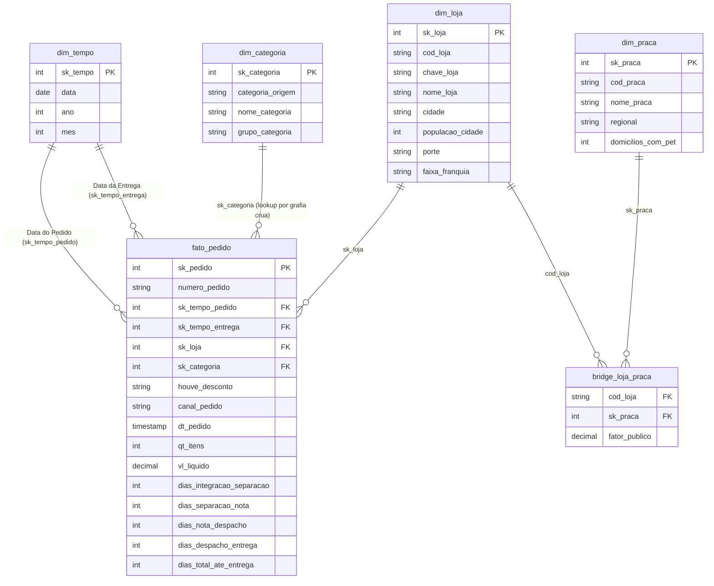

# Análise de Dados com Python [T1] - Mini projeto 2

Documento de requisitos em [Mini-projeto](Mini-projeto.md)   

## Contextualização   

"A Pata Amiga é uma rede catarinense de pet shops. Começou com uma loja em Blumenau, em 2009, e hoje tem 32 lojas espalhadas pelo estado, de Itapoá a São Miguel do Oeste.
Em setembro de 2023, a rede ligou a operação de pedidos com entrega app, site, telefone, WhatsApp e a própria loja física. Em sete meses foram 4.044 pedidos. A diretoria quer usar esses sete meses para decidir o próximo ciclo: onde está o gargalo da entrega, qual categoria sustenta o faturamento, se a política de desconto funciona igual em todo canal, e onde abrir a próxima loja.
O dado existe. O problema é que ele está em três sistemas que não se falam: a plataforma de e-commerce (os pedidos e os marcos da entrega), o cadastro de lojas do franchising, e a planilha de praças de atendimento que o time de expansão mantém à parte. Cada um escreve do seu jeito: a mesma loja aparece com acento, sem acento, em caixa alta e com erro de digitação; a mesma categoria tem várias grafias; data e dinheiro vêm como texto.
Reorganizar dados não parece grande coisa até você ver o que aparece do outro lado. Quando as três bases finalmente conversam, frases assim saltam da tela: que o gargalo não está na entrega, e sim entre a nota fiscal e o despacho; que uma praça concentra faturamento muito acima do seu número de domicílios com pet."


### Respostas das perguntas propostas   

**P1 : Onde está o gargalo da entrega?** Qual o tempo médio, em dias, entre o pedido entrar no ERP e chegar na casa do cliente? E qual dos quatro intervalos do processo  Integração → Separação, Separação → Nota, Nota → Despacho, Despacho → Entrega  é o mais lento? O gargalo é o mesmo nos três portes de loja?  

**Resposta:** Conforme analise das informações extraidas e processadas é possível verificar conforme a tabela abaixo que o gargalo nas operações está entre a Nota → Despacho, sendo que nas lojas de **pequeno porte**, sendo a média de tempo de 8 dias.   

```sql
porte     |media_integracao_separacao|media_separacao_nota|media_nota_despacho|media_despacho_entrega|media_total_ate_entrega|
----------+--------------------------+--------------------+-------------------+----------------------+-----------------------+
Pequena   |                      3.02|                0.69|               8.53|                  2.86|                  15.16|
Total Rede|                      2.13|                0.64|               4.11|                  2.14|                   9.00|
Media     |                      1.98|                0.62|               3.34|                  2.03|                   7.95|
Grande    |                      1.96|                0.64|               3.32|                  2.01|                   7.93|
```

**P2 : Qual categoria concentra o faturamento?** Do faturamento total da rede, quanto vem de cada categoria de produto? Agrupe pelo nome padronizado, nunca pela grafia crua, e mostre também o percentual do total. A categoria campeã é a mesma nos três portes de loja?  

**Resposta:** A ração é a categoria campeã em todas os portes de lojas. É possível verificar que a ração é responsável por mais de 50% do faturamento em todos os portes de lojas. Neste ponto vale fazer uma observação que os brinquedos representam menos de 2% do faturamente e se estes continuam fazendo sentido para as lojas.


```sql
porte  |nome_categoria|faturamento|perc_porte|
-------+--------------+-----------+----------+
Grande |Racao         |  468186.60|     59.92|
Grande |Medicamento   |  135928.72|     17.40|
Grande |Petisco       |   56003.89|      7.17|
Grande |Servico       |   41775.77|      5.35|
Grande |Higiene       |   39253.11|      5.02|
Grande |Acessorio     |   26423.80|      3.38|
Grande |Brinquedo     |   13822.08|      1.77|
Media  |Racao         |  443131.62|     60.14|
Media  |Medicamento   |  128625.36|     17.46|
Media  |Petisco       |   51173.37|      6.94|
Media  |Servico       |   37051.79|      5.03|
Media  |Higiene       |   34716.87|      4.71|
Media  |Acessorio     |   27991.06|      3.80|
Media  |Brinquedo     |   14192.11|      1.93|
Pequena|Racao         |  164197.55|     59.92|
Pequena|Medicamento   |   41349.95|     15.09|
Pequena|Petisco       |   21291.38|      7.77|
Pequena|Higiene       |   18166.47|      6.63|
Pequena|Servico       |   15173.81|      5.54|
Pequena|Acessorio     |   10246.53|      3.74|
Pequena|Brinquedo     |    3620.37|      1.32|
```

**P3 : O desconto funciona igual em todo canal?** Compare o ticket médio COM e SEM desconto dentro de cada canal de venda (App, Site, Loja Física, Telefone, WhatsApp). Se o desconto derruba o ticket em um canal e não em outro, a política não deveria ser a mesma nos dois. Diga também quanto cada canal representa do faturamento. 

**Resposta:**  Os descontos não derrubam o ticket médio em nenhum canal de venda. O comportamento é consistente e inverso à premissa, sendo que em todos os canais, os pedidos com desconto possuem um ticket médio de 150% a 191% maior do que os pedidos sem desconto. Isso indica que a política atual provavelmente está atrelada a gatilhos de volume ou valor mínimo.

Representatividade de Faturamento por Canal:
- App: 30,79% (Principal canal)
- Site: 25,13%
- Loja Física: 20,11%
- WhatsApp: 10,52%
- Telefone: 6,88%
- Não Informado: 6,57%

```sql
canal_pedido |total_pedidos|faturamento|perc_faturamento|ticket_com_desconto|ticket_sem_desconto|variacao_ticket_perc|
-------------+-------------+-----------+----------------+-------------------+-------------------+--------------------+
App          |         1273|  552134.43|           30.79|             488.04|             167.63|              191.14|
Site         |         1032|  450569.37|           25.13|             501.92|             189.68|              164.61|
Loja Fisica  |          824|  360677.22|           20.11|             494.04|             197.55|              150.08|
WhatsApp     |          414|  188678.63|           10.52|             514.33|             179.26|              186.91|
Telefone     |          264|  123419.29|            6.88|             514.02|             195.23|              163.29|
Nao Informado|          237|  117829.57|            6.57|             561.59|             206.95|              171.37|
```


**P4 : Qual praça de atendimento concentra o faturamento?** Atenção: uma loja entrega em mais de uma praça. O rateio precisa ser feito pelo percentual do público, e a soma por praça tem de fechar com o faturamento da rede. Cruze o faturamento rateado com o número de domicílios com pet de cada praça. 

**Resposta:**  O Vale do Itajaí domina o faturamento da rede. Sozinho, representa mais de um terço da receita (35,34%) e apresenta o maior ticket/eficiência por domicílio com pet (R$ 4,28).

```sql
nome_praca          |regional      |domicilios_com_pet|faturamento_rateado|perc_faturamento|faturamento_por_domicilio_pet|
--------------------+--------------+------------------+-------------------+----------------+-----------------------------+
Vale do Itajai      |Regional Leste|            148000|          633746.09|           35.34|                         4.28|
Grande Florianopolis|Regional Leste|            132000|          283546.75|           15.81|                         2.15|
Norte Industrial    |Regional Norte|             96000|          175431.90|            9.78|                         1.83|
Litoral Sul         |Regional Sul  |             58000|          137051.20|            7.64|                         2.36|
Litoral Norte       |Regional Norte|             61000|          128872.75|            7.19|                         2.11|
Extremo Oeste       |Regional Oeste|             63000|           98359.18|            5.48|                         1.56|
Carbonifera         |Regional Sul  |             67000|           88707.42|            4.95|                         1.32|
Serra Catarinense   |Regional Oeste|             44000|           80477.64|            4.49|                         1.83|
Meio-Oeste          |Regional Oeste|             51000|           58955.63|            3.29|                         1.16|
Foz do Itajai       |Regional Leste|             74000|           46749.72|            2.61|                         0.63|
Planalto Norte      |Regional Norte|             33000|           31100.84|            1.73|                         0.94|
Planalto Serrano    |Regional Oeste|             29000|           29323.10|            1.64|                         1.01|
```

**P5 : Onde abrir a próxima loja, e o que os dados NÃO permitem afirmar?**   
1) Ranqueie as lojas por itens vendidos por mil habitantes da cidade  não em valor absoluto  e cruze com o tempo médio de entrega.   
2) A faixa de franquia no cadastro é a de hoje: o passado foi sobrescrito. Mostre o faturamento por faixa ATUAL e explique por que isso não responde “quanto veio de lojas que JÁ ERAM Ouro na data do pedido”.  
3) Meça o que ficou de fora: pedidos sem loja identificada, entregas ainda não concluídas, itens e valores em branco.

**Resposta:** 

Conforme os dados disponibilizados e analisados, é possível ver um indicativo para cidades pequenas (11 a 27 mil habitantes), que estão no topo do ranking de itens vendidos por mil habitantes, mas possuem o dobro do tempo de entrega. Porém essa relação pode ser efeito do tamanho pequeno da população, e não uma causa direta entre alta demanda e entrega lenta — desta forma, não é possível indicar com clareza a próxima cidade ideal para uma nova loja.


## Desenvolvimento do desafio   

Iniciando com a configuração do ambiente, escolhido utilizar o PostgreSQL com container docker (docker-compose) para iniciar uma nova instancia do banco de dados, desta forma com isolamento.  

### Tarefa 1.

Carga dos arquivos de banco de dados que já estão prontos para o uso **01-carga-staging.sql**

**Observação:** Utilizando usuário e senha de banco simples somente para facilitar o uso das consultas.   

Carregar os dados para dentro do banco de dados, executando os scripts de 01-carga-staging.sql: **psql -U postgres -d postgres < 01-carga-staging.sql**     
Carregar os scripts de 02-dimensoes-prontas.sql: **psql -U postgres -d postgres < 02-dimensoes-prontas.sql**    

Confirmar que os dados foram carregados de forma correta, através da execução do script 00-conferencia.sql: 

**psql -U postgres -d postgres < 00-conferencia.sql**

Resultado: 
```sql
     tabela     | linhas | esperado 
----------------+--------+----------
 stg_pedido     |   4044 |     4044
 stg_loja       |     32 |       32
 stg_loja_praca |     48 |       48
(3 rows)

                  diagnostico                   | valor |      esperado      
------------------------------------------------+-------+--------------------
 pedidos sem nome de loja (vao para a -1)       |     3 | 3
 pedidos sem Cod Loja preenchido                |  1575 | 1575  (~39%)
 grafias distintas de categoria (no PostgreSQL) |    37 | 37
 grafias distintas de CanalPedido               |    20 | (conte)
 grafias distintas de HouveDesconto             |    17 | (conte)
 grafias distintas de nome de loja              |   128 | (conte e descreva)
(6 rows)
.
.
.
```

#### Diagnóstico da origem   

**Resultado**   

|Pergunta|Resposta|
|---|---|
|Quantas gráfias de lojas existem?|128|
|Quantas de categoria?|37|
|Quantos pedidos vieram sem código de loja?|1575|
|Quantos sem nome de loja?|3|
|Quantos marcos de processo estão em branco?|6033 - detalhamento abaixo|
|Grafias distintas de canal de pedido|20|

| Item Auditado | Contagem Apurada | Impacto e Decisão de Modelagem |
| :--- | :---: | :--- |
| **Quantas gráfias de lojas existem?** | **128** | Variações com/sem acento, caixa alta/baixa, sufixo `/SC`, espaços duplos e erros de digitação (ex.: `BLUMENAL CENTRO`, `FLORIPA NORTE`, `JGUA DO SUL`). Tratadas por normalização prévia antes do *lookup*. |
| **Quantas de categoria?** | **37** | Dezenas de grafias cruas para 7 categorias oficiais. Mapeadas na dimensão `dim_categoria` através de *de-para* com precedência estrita (`MED` antes de `RA`). |
| **Quantos pedidos vieram sem código de loja?** | **1.575** | Impossibilitou a ligação direta por código na fato; o vínculo com `dim_loja` precisou ser resolvido pelo nome padronizado da loja (`chave_loja`). |
| **Quantos sem nome de loja?** | **3** | Pedidos sem identificação de loja. Direcionados obrigatoriamente para a linha de exceção `-1` da `dim_loja` (zero FKs nulas). |
|**Quantos marcos de processo estão em branco?**|6033|Data separação em branco = 1077 / Nota fiscal em bracno 1338 / Total despachos em branco = 1665 /Total de entregas para clientes = em branco 1953 |
| **Grafias distintas de canal de pedido** | **20** | Variações de caixa e abreviações para 5 canais. Padronizados na fato com regra de precedência (`WHATS` antes de `APP`). |


**Desenvolvimento**

- **Quantas gráfias de lojas existem?** Sem o tratamento de dados, o sistema apresenta 128 registros de nomes diferentes, utilizando a consulta abaixo: 
Esta consulta também responde a pergunta **Quantos sem nome de loja?**

```sql
select
	sp."Loja-Nome",count(1)
from
	stg_pedido sp
group by sp."Loja-Nome"
order by sp."Loja-Nome"
```

Conforme a amostragem abaixo da consulta acima:    

```sql
Loja-Nome                           |count|
------------------------------------+-----+
                                    |    3|
Pata Amiga Ararangua                |   39|
PATA AMIGA ARARANGUA                |   19|
pata amiga araranguá                |   22|
Pata Amiga Araranguá                |   27|
Pata Amiga Blumenal Centro          |   41|
pata amiga blumenau centro          |   50|
 Pata Amiga Blumenau Centro         |   50|
.
.
.
128 rows
```
- **Quantas de categoria?** Apresenta um totald de 37, sem o tratamento dos dados.   

```sql
select
	sp."CategoriaProduto",count(1)
from
	stg_pedido sp
group by sp."CategoriaProduto"
order by sp."CategoriaProduto"

CategoriaProduto   |count|
-------------------+-----+
acessorio          |   43|
Acessorio          |   37|
ACESSORIO          |   60|
Acessório          |   53|
Acessorios         |   70|
brinquedo          |   49|
Brinquedo          |   42|
BRINQUEDO          |   50|
Brinquedos         |   51|
.
.
.
37 rows
```

- **Quantos pedidos vieram sem código de loja?**  Total de 1575

```sql
select
	count(1)
from
	stg_pedido sp
where
	TRIM(sp."Cod Loja") = '' or
	sp."Cod Loja" is null

count|
-----+
 1575|
```   

- **Canal pedido** total de 20

```sql
select
	sp."CanalPedido",count(1)
from
	stg_pedido sp
group by sp."CanalPedido"
order by sp."CanalPedido"

CanalPedido   |count|
--------------+-----+
              |  237|
app           |  312|
App           |  316|
APP           |  325|
App Pata Amiga|  320|
.
.
.
20 rows
```

- **Quantos marcos de processo estão em branco?**  Realizando a pesquisa por cada marco que está em branco. 

Data separação em branco = 1077   
Nota fiscal em bracno 1338   
Total despachos em branco = 1665   
Total de entregas para clientes = em branco 1953

```sql
select
	sum(case when sp."Dt Separacao Estoque" is null or trim(sp."Dt Separacao Estoque") = '' then 1 else 0 end) as total_dt_separacao_estoque,
	sum(case when sp."DtNotaFiscal" is null or trim(sp."DtNotaFiscal") = '' then 1 else 0 end) as total_nota_fiscal,
	sum(case when sp."Dt_Despacho_Transportadora" is null or trim(sp."Dt_Despacho_Transportadora") = '' then 1 else 0 end) as total_despacho,
	sum(case when sp."DtEntregaCliente" is null or trim(sp."DtEntregaCliente") = '' then 1 else 0 end) as total_entrega_cliente
from
	stg_pedido sp

total_dt_separacao_estoque|total_nota_fiscal|total_despacho|total_entrega_cliente|
--------------------------+-----------------+--------------+---------------------+
                      1077|             1338|          1665|                 1953|
```


## Tarefa 2: Tatamento  && Tarefa 3: Contruir as dimensões

As tarefas 2 e 3 podem ser resolvidas em uma única tarefa, pois o tratamento de dados está diretamente relacionado com a atividade de popular as tabelas de dimensão.

Iniciando o processo com a dim_categoria, com inclusão da categoria "Nao Informado", depois disso executado INSERT com select na tabela. Para confirmar a criação correta é executado o SQL abaixo: 

```sql
SELECT 'dim_categoria'     AS tabela, COUNT(*) AS linhas,
       '38 no PostgreSQL - varia por banco' AS esperado FROM dim_categoria
UNION ALL SELECT 'dim_praca',         COUNT(*), '13  (12 pracas + a -1)' FROM dim_praca
UNION ALL SELECT 'bridge_loja_praca', COUNT(*), '48' FROM bridge_loja_praca;
```

Com resultado:   

```sql
tabela           |linhas|esperado                          |
-----------------+------+----------------------------------+
dim_categoria    |    38|38 no PostgreSQL - varia por banco|
dim_praca        |    13|13  (12 pracas + a -1)            |
bridge_loja_praca|    48|48                                |
```

Consulta de categorias padronizadas: 

```sql
SELECT COUNT(DISTINCT nome_categoria) AS categorias_padronizadas,
       '8 = as 7 categorias + a linha -1' AS esperado FROM dim_categoria;
```

Resultado: 

```sql
categorias_padronizadas|esperado                        |
-----------------------+--------------------------------+
                      8|8 = as 7 categorias + a linha -1|
```

Consulta para verificar resultados vazios: 

```sql
SELECT categoria_origem, nome_categoria FROM dim_categoria
WHERE nome_categoria = 'Nao Informado' AND sk_categoria <> -1;
```

Resultado: 

```sql
categoria_origem|nome_categoria|
----------------+--------------+
```

Consulta para verificar ordem do case:   

```sql
-- Ordem do CASE, teste 1: "Racao Medicamentosa" deve ser Medicamento.
-- Se aparecer 'Racao' na segunda coluna, o CASE testou RA antes de MED.
SELECT categoria_origem, nome_categoria, 'Medicamento' AS esperado
FROM dim_categoria WHERE UPPER(categoria_origem) LIKE '%MEDICAMENTOSA%';
```
Resultado:   

```sql
categoria_origem   |nome_categoria|esperado   |
-------------------+--------------+-----------+
Racao Medicamentosa|Medicamento   |Medicamento|
Ração Medicamentosa|Medicamento   |Medicamento|
```

Consulta da tabela ponte:  

```sql
-- A ponte: o fator deve somar 1,00 em cada loja. A consulta deve voltar VAZIA.
SELECT cod_loja, ROUND(SUM(fator_publico), 4) AS soma_dos_fatores
FROM bridge_loja_praca GROUP BY cod_loja
HAVING ROUND(SUM(fator_publico), 4) <> 1;
```

Resultado:   

```sql
cod_loja|soma_dos_fatores|
--------+----------------+
```

Consulta pelas lojas e pracas:  

```sql
-- As 32 lojas devem estar na ponte, e toda praca deve ter pelo menos uma loja.
SELECT 'lojas na ponte' AS teste, COUNT(DISTINCT cod_loja) AS valor, '32' AS esperado
FROM bridge_loja_praca
UNION ALL SELECT 'pracas na ponte', COUNT(DISTINCT sk_praca), '12' FROM bridge_loja_praca;
```

Resultado: 

```sql
teste          |valor|esperado|
---------------+-----+--------+
lojas na ponte |   32|32      |
pracas na ponte|   12|12      |
```

Consulta linha -1 nas dimensões:   

```sql
-- Toda dimensao precisa da linha -1. As duas devem aparecer aqui.
SELECT 'dim_categoria' AS dimensao, COUNT(*) AS tem_a_linha_menos_1
FROM dim_categoria WHERE sk_categoria = -1
UNION ALL SELECT 'dim_praca',       COUNT(*) FROM dim_praca       WHERE sk_praca = -1;
```

Resultado: 

```sql
dimensao     |tem_a_linha_menos_1|
-------------+-------------------+
dim_categoria|                  1|
dim_praca    |                  1|
```

### Tarefa 4: Tabela Fato   

Execução da tarefa 4, populando a tabela fato.   

1. Foi realizado um único INSERT ... SELECT para carregar a tabela fato_pedido a partir dos pedidos armazenados em stg_pedido.
2. As datas foram convertidas para formatos padronizados, gerando chaves substitutas no padrão numérico AAAAMMDD.
3. As lojas e categorias foram relacionadas às respectivas dimensões utilizando LEFT JOIN, preservando todos os pedidos carregados.
4. Nomes de lojas foram normalizados, removendo acentos, espaços duplicados, sufixos estaduais e corrigindo variações cadastrais.
5. Registros sem correspondência dimensional receberam a chave -1, evitando valores nulos nas chaves estrangeiras.
6. Os campos de desconto e canal de pedido foram padronizados mediante regras CASE, classificando diferentes formatos de preenchimento.
7. Quantidades e valores monetários foram convertidos para tipos numéricos, tratando registros vazios, hífens, símbolos monetários e separadores brasileiros.
8. Foram calculados os intervalos em dias entre integração, separação, emissão da nota, despacho e entrega ao cliente.
9. Registros sem datas necessárias permaneceram com intervalos nulos, evitando interpretações incorretas de etapas não realizadas.
10. Ao final, foram executadas conferências para validar a quantidade de pedidos, chaves estrangeiras, datas, canais e possíveis períodos negativos.


#### Modelo Dimensional (Star Schema)

O modelo dimensional foi implementado seguindo o padrão Kimball, com uma tabela fato central, quatro dimensões e uma tabela ponte:

* **Grão da Fato (`fato_pedido`)**: Estritamente **1 linha = 1 pedido** (**4.044 linhas**).
* **Dimensão com Duplo Papel (*Role-Playing Dimension*)**: A tabela `dim_tempo` conecta-se duas vezes à fato:
  * `sk_tempo_pedido`: momento da compra do cliente.
  * `sk_tempo_entrega`: momento da entrega final (aponta para `-1` nos 1.953 pedidos em aberto).
* **Tratamento Many-to-Many (N:N)**: Como uma loja pode atender mais de uma praça, a ligação ocorre de forma indireta:  
  `fato_pedido` $\rightarrow$ `dim_loja` $\rightarrow$ `bridge_loja_praca` (com `fator_publico`) $\rightarrow$ `dim_praca`.




### Tarefa 5 : Responder e recomendar   

Resolução no documento [Tarefa5](./tarefa5.md)

### Configuração do ambiente   

Executando o banco de dados utilizando container do PostgreSQL - 16.    
Para inciar o banco de dados:
```bash
docker compose up -d
docker compose ps
```

Para carregar os arquivos de banco de dados:   

```bash
docker compose exec -T postgres \
  psql -U postgres -d postgres < 01-carga-staging.sql
docker compose exec -T postgres \
  psql -U postgres -d dw_pata_amiga < 02-dimensoes-prontas.sql
```


## Reprodutibilidade do Banco de Dados

Para reproduzir o Data Warehouse completo a partir do zero no PostgreSQL 16:

1. **`01-carga-staging.sql`**: Cria o banco `dw_pata_amiga` e carrega as 3 tabelas de staging com tipos originais texto.
2. **`02-dimensoes-prontas.sql`**: Cria as tabelas dimensionais e carrega `dim_tempo` (236 linhas) e `dim_loja` (33 linhas).
3. **`03-dimensoes.sql`**: Carrega `dim_categoria` (38 linhas), `dim_praca` (13 linhas) e `bridge_loja_praca` (48 linhas com soma dos fatores = 1,00).
4. **`04-fato.sql`**: Executa a carga de `fato_pedido` com 4.044 linhas, cálculo de intervalos e integridade referencial.
5. **`05-perguntas.sql`**: Scripts das consultas analíticas para as perguntas de negócio.
6. **`00-conferencia.sql`**: Script de validação e testes de integridade contábil.